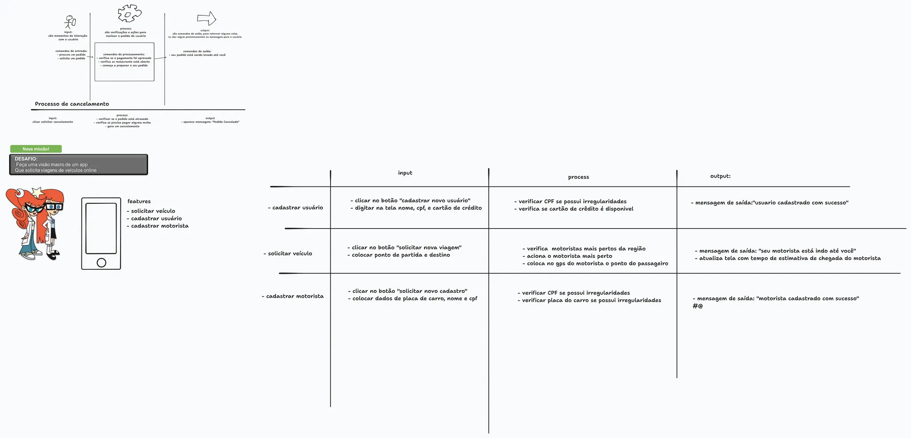

## informacoes

- Material: https://helpful-jump-17b.notion.site/Mapa-de-aventura-91f3e9bd923842149d4dba754dc65c07?p=37c961da5fea45b69538f4a365feb88a&pm=c

- https://playcode.io/javascript

- https://www.w3schools.com/tryit/trycompiler.asp?filename=demo_nodejs

# Estrutura de um programa

As features (ou funcionalidades) em um aplicativo são as diferentes tarefas ou funções que o aplicativo pode realizar. Por exemplo, se um aplicativo de câmera tem uma funcionalidade de zoom, essa é uma feature. As features podem variar dependendo do aplicativo e do seu propósito.

input: movimentos de interação do usuario
process: Verificação da ação para realizar o pedido do usuário
output: Comando de saída para realizar ou dar algum posicionamento para o usuario

funcionalidade = features

Desafio: 
faça uma visao macro de um app que solicite viagens de veiculos online

Questions:

Em uma condição normal, qual a ordem de execução de processos ?

INPUT / PROCESS/ OUTPUT

O que é um INPUT ?

É qualquer entrada de dados ou interação do usuário

O que é a etapa de process ?

É o momento aonde validações, transformações e ações são executadas com base em um input recebido

O que é a etapa de output ?

É um comando para imprimir texto na tela ou o retorno para outra parte da aplicação