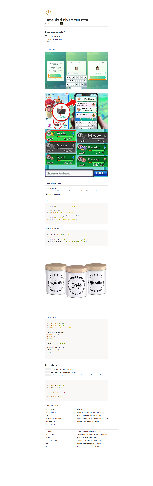

## informacoes

- Material: https://helpful-jump-17b.notion.site/Tipos-de-dados-e-vari-veis-4fdc1ae1745a4b2b819d12cb4f51aaa1

- https://playcode.io/javascript

- https://www.w3schools.com/tryit/trycompiler.asp?filename=demo_nodejs


# Tipos de dados e variáveis

### O que vamos aprender ?

---

- [ ]  O que são variáveis
- [ ]  Como utilizar variáveis
- [ ]  Tipos de variáveis


declarando variáveis

```jsx
console.log("Digita o nome do seu jogador")

//declara uma variável
let nickname = "Maria mestra do Pikachu"

//concantenando uma mensagem fixa + uma variável
console.log("Bem vinda " + nickname)
console.log(nickname + " entrou no servidor")
```

declarando constantes

```jsx
const notificacao = "Pokemon Go diz: "

//saida
console.log(notificacao + "tem um novo pokemon na região")
console.log(notificacao + "você foi derrotado por um líder")
```

Ajudando a vovó

```jsx
let poteCafe = "café pilão"
let poteAcucar = "Açucar cristal"
let poteBiscoito = "Biscoito Maizena"
const messagemDaVovo = "Na cozinha da vovó hoje tem: "

console.log(messagemDaVovo + 
poteCafe + " - " +
poteAcucar + " - " +
poteBiscoito
)

poteCafe = "Café 3 corações"

console.log(messagemDaVovo + 
poteCafe + " - " +
poteAcucar + " - " +
poteBiscoito
)
```

### Tipos variáveis

---

`string` - são variaveis que armazenam texto

**`number` - são variaveis que armazenam números**

`boolean` - são variaveis lógicas, que armazenam o valor de ligado ou desligado (true/false)

```jsx
//pokemon
let nomePokemon = "pikachu"
let pokemonSexo = "M"
let nivelPokemon = 20
let pontosDeVidaPokemon = 45
let selecionavel = false
```

Outros tipos de variáveis
Tipo de Variável	                     Descrição
Variáveis numéricas	                 São usadas para armazenar valores numéricos.
Inteiro	                             Armazena números inteiros, como 1, 10, -5.
Ponto flutuante ou decimal	         Armazena números com casas decimais, como 3.14, -0.5.
Números complexos	                 Armazena números complexos, como 2+3j.
Variáveis de texto	                 Usadas para armazenar sequências de caracteres.
String	                             Armazena uma sequência de caracteres, como "Olá, mundo!"
Caractere	                         Armazena um único caractere, como 'a', 'X', '@'.
Variáveis lógicas	                 Usadas para armazenar valores de verdadeiro ou falso.
Booleano	                         Armazena os valores True ou False.
Variáveis de data e hora	         Utilizadas para representar datas e horários.
Data	                             Armazena datas, no formato AAAA-MM-DD.
Hora	                             Armazena horários, no formato HH:MM:SS.


// Desafio da vovó - Declarando variavéis
// string = armazenas texto
// number - armazenas numeros
// bolean = armazenas valores logicos

let nomePessoa      = "vovo felipao"
let idade           = 92
let numeroTelefone  = "11-997840021"
let cpf             = "31249522201"
let endereco        = "Avenida pythinho, numero 75, bairro voando baixo"
let recebePensao    = true

Questions:

Qual dos tipos abaixo NÃO é um tipo de variável ?
dumper

Qual das opções abaixo é uma afirmação verdadeira ?
Variáveis é um conceito universal da computação

O que guarda o tipo string ?
Texto

O que são variáveis ?
Pequenos espaços na memória de uma aplicação para armazenar algum valor


//


