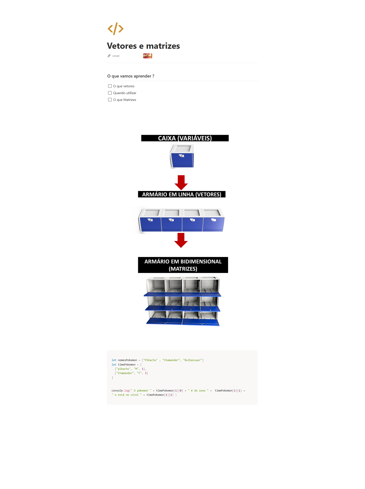

## informacoes

- Material: https://helpful-jump-17b.notion.site/Tipos-de-dados-e-vari-veis-4fdc1ae1745a4b2b819d12cb4f51aaa1

- https://playcode.io/javascript

- https://www.w3schools.com/tryit/trycompiler.asp?filename=demo_nodejs

## Vetores e matrizes

### O que vamos aprender ?

---

- [ ]  O que vetores
- [ ]  Quando utilizar
- [ ]  O que Matrizes

- Vetores
let nomesPokemon = ["Pikachu" , "Chamander", "Bulbassaur"]
console.log(" O pokemon " + nomesPokemon[0])

- Matrizes

let nomesPokemon = ["Pikachu" , "Chamander", "Bulbassaur"]
let timePokemon = [
  ["pikachu", "M", 1],
  ["Chamander", "F", 3]
]
console.log(" O pokemon " + timePokemon[1][0] + " é do sexo " +  timePokemon[1][1] + 
" e está no nível " + timePokemon[1][2] )

/# 
     obs: Uma unica informacao é utilizado uma variavél
     Varias informacoes do mesmo tipo é utilizado vetores
     Varias informações e de varios tipos é utilizado matrizes
     Uma informação que não se altera, utiliza uma constante.
#/

Quetions

O que é uma matriz?
É uma estrutura de dados bidimensional que armazena valores em linhas e colunas

O que é um vetor?
É uma estrutura de dados que armazena uma coleção ordenada de elementos do mesmo tipo

Quando utilizar um vetor?
Quando você precisa armazenar uma coleção de elementos

Por que utilizar matrizes em programação?
Para representar dados de duas dimensões, como tabelas

