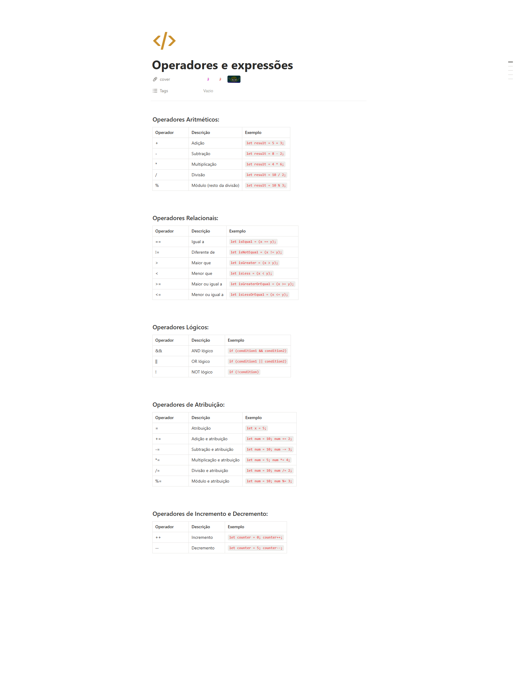

## informacoes

- Material: https://helpful-jump-17b.notion.site/Mapa-de-aventura-91f3e9bd923842149d4dba754dc65c07?p=bd2a3b0673664c6d977a0686ba0d86cd&pm=c

- https://playcode.io/javascript

- https://www.w3schools.com/tryit/trycompiler.asp?filename=demo_nodejs

## Operadores e expressões

### Operadores Aritméticos:

Operador	Descrição	                   Exemplo
+	        Adição	                    let result = 5 + 3;
-	        Subtração	                let result = 8 - 2;
*	        Multiplicação	            let result = 4 * 6;
/	        Divisão	                    let result = 10 / 2;
%	        Módulo (resto da divisão)	let result = 10 % 3;

### Operadores Relacionais:

Operador	Descrição	                    Exemplo
==	         Igual a	                let isEqual = (x == y);
!=	         Diferente de	            let isNotEqual = (x != y);
>	         Maior que	                let isGreater = (x > y);
<	         Menor que	                let isLess = (x < y);
>=	         Maior ou igual a	        let isGreaterOrEqual = (x >= y);
<=	         Menor ou igual a	        let isLessOrEqual = (x <= y);

### Operadores Lógicos:

Operador	Descrição	                   Exemplo
&&	        AND lógico	               if (condition1 && condition2)
||	        OR lógico	               if (condition1 || condition2)
!	        NOT lógico	               if (!condition)

### Operadores de Atribuição:

Operador	Descrição	                   Exemplo
=	        Atribuição	                let x = 5;
+=	        Adição e atribuição	        let num = 10; num += 2;
-=	        Subtração e atribuição	    let num = 10; num -= 3;
*=	        Multiplicação e atribuição	let num = 5; num *= 4;
/=	        Divisão e atribuição	    let num = 10; num /= 2;
%=	        Módulo e atribuição	        let num = 10; num %= 3;

### Operadores de Incremento e Decremento:

Operador	Descrição	                   Exemplo
++	        Incremento	                let counter = 0; counter++;
--	        Decremento	                let counter = 5; counter--;

## Questions

Qual é o operador utilizado para adição em programação?

+

Qual é o operador de comparação para verificar igualdade em valores e tipos em programação?

== ou ===

O que é uma expressão em programação?

Uma combinação de valores, variáveis e operadores que pode ser avaliada

O que são operadores em programação?

São símbolos ou palavras-chave que realizam operações em valores ou variáveis

