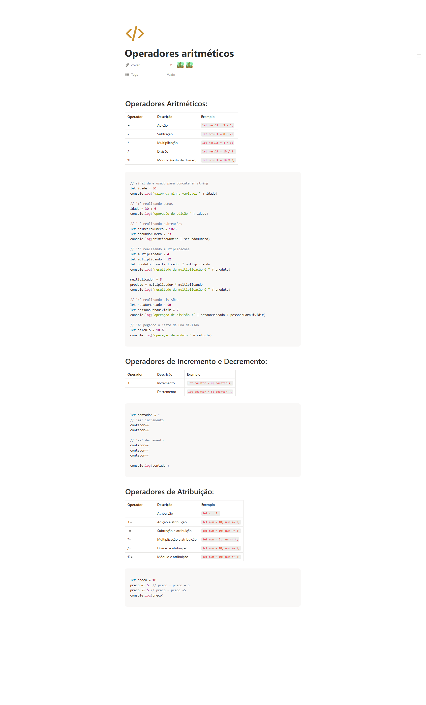

## informacoes

- Material: https://helpful-jump-17b.notion.site/Mapa-de-aventura-91f3e9bd923842149d4dba754dc65c07?p=bd2a3b0673664c6d977a0686ba0d86cd&pm=c

- https://playcode.io/javascript

- https://www.w3schools.com/tryit/trycompiler.asp?filename=demo_nodejs

## Operadores e expressões

### Operadores Aritméticos:

Operador	Descrição	                   Exemplo

+	        Adição	                    let result = 5 + 3;
-	        Subtração	                let result = 8 - 2;
*	        Multiplicação	            let result = 4 * 6;
/	        Divisão	                    let result = 10 / 2;
%	        Módulo (resto da divisão)	let result = 10 % 3;

// sinal de + usado para concatenar string

let idade = 30
console.log("valor da minha variavel " + idade)

// '+' realizando somas

idade = 30 + 6
console.log("operação de adição " + idade)

// '-' realizando subtrações

let primeiroNumero = 1023
let secundoNumero = 23
console.log(primeiroNumero - secundoNumero)

// '*' realizando multiplicações

let multiplicador = 4
let multiplicando = 12
let produto = multiplicador * multiplicando
console.log("resultado da multiplicação é " + produto)

multiplicador = 8
produto = multiplicador * multiplicando
console.log("resultado da multiplicação é " + produto)

// '/' realizando divisões

let notaDoMercado = 50
let pessoasParaDividir = 2
console.log("operação de divisão :" + notaDoMercado / pessoasParaDividir)

// '%' pegando o resto de uma divisão

let calculo = 10 % 3
console.log("operação de módulo " + calculo)

### Operadores Relacionais:

Operador	Descrição	                    Exemplo

==	         Igual a	                let isEqual = (x == y);
!=	         Diferente de	            let isNotEqual = (x != y);
>	         Maior que	                let isGreater = (x > y);
<	         Menor que	                let isLess = (x < y);
>=	         Maior ou igual a	        let isGreaterOrEqual = (x >= y);
<=	         Menor ou igual a	        let isLessOrEqual = (x <= y);

### Operadores Lógicos:

Operador	Descrição	                   Exemplo

&&	        AND lógico	               if (condition1 && condition2)
||	        OR lógico	               if (condition1 || condition2)
!	        NOT lógico	               if (!condition)

### Operadores de Atribuição:

Operador	Descrição	                   Exemplo

=	        Atribuição	                let x = 5;
+=	        Adição e atribuição	        let num = 10; num += 2;
-=	        Subtração e atribuição	    let num = 10; num -= 3;
*=	        Multiplicação e atribuição	let num = 5; num *= 4;
/=	        Divisão e atribuição	    let num = 10; num /= 2;
%=	        Módulo e atribuição	        let num = 10; num %= 3;

let preco = 10
preco += 5     // preco = preco + 5
preco -= 5     // preco = preco -5
console.log(preco)

### Operadores de Incremento e Decremento:

Operador	Descrição	                   Exemplo

++	        Incremento	                let counter = 0; counter++;
--	        Decremento	                let counter = 5; counter--;

let contador = 1
// '++' incremento  
// obs: contador++ é igual a contador = contador + 1
contador++
contador++

// '--' decremento
// obs: contador-- é igual a contador = contador - 1
contador--
contador--
contador--

console.log(contador)

### Definindo Escopos
// resolve operacoes aritimeticas na forma correta

let resultado = 2 * ((5 + 10) - 10)
console.log(resultado)

## Questions

Qual é o valor resultante da expressão 3 * 2 + 8 na programação com base na ordem de operações ?

Conta:
3*2+8

Passo 1 – Multiplicação primeiro
3*2=6
Passo 2 – Somar o resultado com 8
6+8=14
✅ Resultado final:
3*2+8=14

Qual é o operador utilizado para multiplicação em programação?

*

O que a expressão 20 / 5 retorna em programação?

4

Qual é o resultado da expressão 15 + 7 em programação?

22

Qual é o operador aritmético para calcular o resto da divisão em programação?

%

