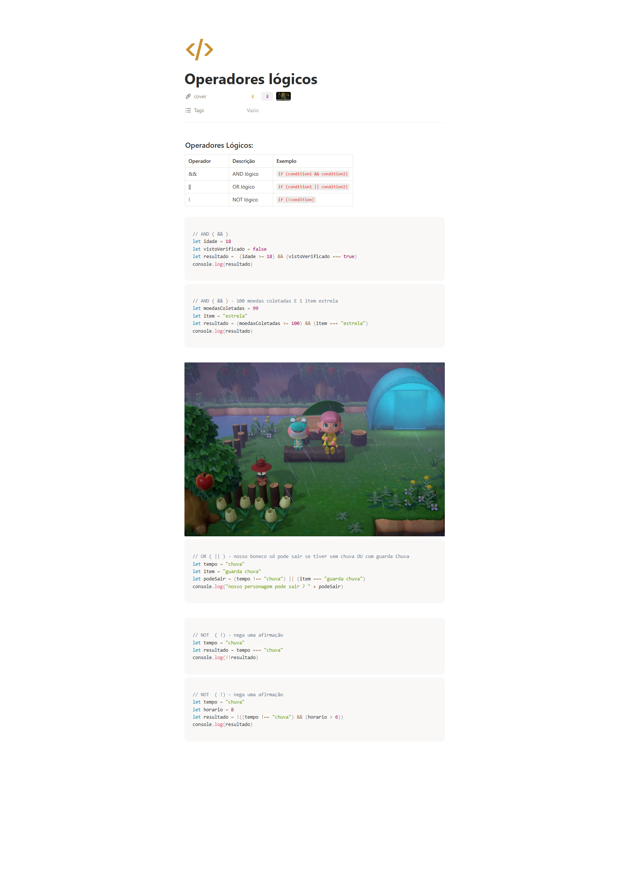

## informacoes

- Material: https://helpful-jump-17b.notion.site/Operadores-l-gicos-0c9c26fa1f8f4fb9889baf29e7108939

- https://playcode.io/javascript

- https://www.w3schools.com/tryit/trycompiler.asp?filename=demo_nodejs

## Operadores e expressões

### Operadores lógicos:

Operador	Descrição	                Exemplo
&&	        AND lógico	          if (condition1 && condition2)
||	        OR lógico	          if (condition1 || condition2)
!	        NOT lógico	          if (!condition)

// AND ( && )
let idade = 18
let vistoVerificado = false
let resultado =  (idade >= 18) && (vistoVerificado === true) 
console.log(resultado)

// AND ( && ) - 100 moedas coletadas E 1 item estrela
let moedasColetadas = 99
let item = "estrela"
let resultado = (moedasColetadas >= 100) && (item === "estrela")
console.log(resultado)

// OR ( || ) - nosso boneco só pode sair se tiver sem chuva OU com guarda Chuva
let tempo = "chuva"
let item = "guarda chuva"
let podeSair = (tempo !== "chuva") || (item === "guarda chuva")
console.log("nosso personagem pode sair ? " + podeSair)

// NOT  ( !) - nega uma afirmação
let tempo = "chuva"
let resultado = tempo === "chuva"
console.log(!!resultado)

// NOT  ( !) - nega uma afirmação
let tempo = "chuva"
let horario = 8
let resultado = !((tempo !== "chuva") && (horario > 6))
console.log(resultado)

## Questions

O que o operador "!" representa em programação?

Inverte o valor de uma condição (negação lógica)

Qual é o resultado da expressão "true || false"?

Verdadeiro (true)

O que o operador "||" faz em programação?

Realiza uma operação lógica "OU" entre duas condições

Qual é o resultado da expressão lógica "true && false"?

Falso (false)

Qual é o resultado da expressão "!(true)"?

Falso (false)

