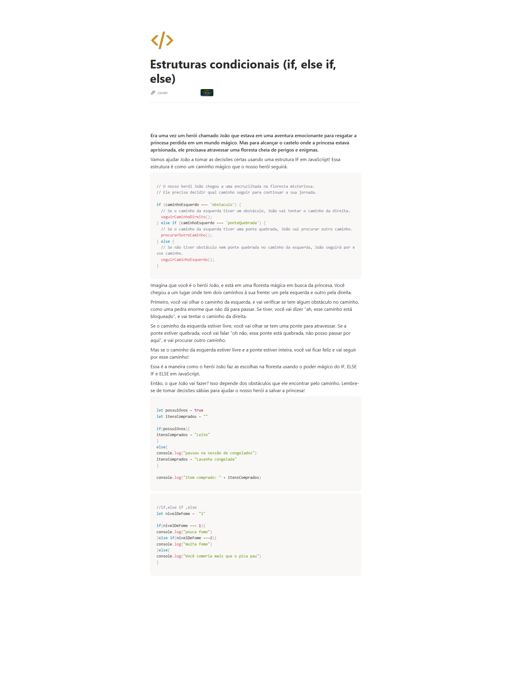

## informacoes

- Material: https://helpful-jump-17b.notion.site/Mapa-de-aventura-91f3e9bd923842149d4dba754dc65c07?p=c5bc44e4b81448a1bb443713e498f016&pm=c

- https://playcode.io/javascript

- https://www.w3schools.com/tryit/trycompiler.asp?filename=demo_nodejs

## Estruturas condicionais (if, else if, else)

**Era uma vez um herói chamado João que estava em uma aventura emocionante para resgatar a princesa perdida em um mundo mágico. Mas para alcançar o castelo onde a princesa estava aprisionada, ele precisava atravessar uma floresta cheia de perigos e enigmas.**

Vamos ajudar João a tomar as decisões certas usando uma estrutura IF em JavaScript! Essa estrutura é como um caminho mágico que o nosso herói seguirá.

```jsx
// O nosso herói João chegou a uma encruzilhada na floresta misteriosa.
// Ele precisa decidir qual caminho seguir para continuar a sua jornada.

if (caminhoEsquerdo === 'obstaculo') {
  // Se o caminho da esquerda tiver um obstáculo, João vai tentar o caminho da direita.
  seguirCaminhoDireito();
} else if (caminhoEsquerdo === 'ponteQuebrada') {
  // Se o caminho da esquerda tiver uma ponte quebrada, João vai procurar outro caminho.
  procurarOutroCaminho();
} else {
  // Se não tiver obstáculo nem ponte quebrada no caminho da esquerda, João seguirá por esse caminho.
  seguirCaminhoEsquerdo();
}
```

Imagina que você é o herói João, e está em uma floresta mágica em busca da princesa. Você chegou a um lugar onde tem dois caminhos à sua frente: um pela esquerda e outro pela direita.

Primeiro, você vai olhar o caminho da esquerda, e vai verificar se tem algum obstáculo no caminho, como uma pedra enorme que não dá para passar. Se tiver, você vai dizer "ah, esse caminho está bloqueado", e vai tentar o caminho da direita.

Se o caminho da esquerda estiver livre, você vai olhar se tem uma ponte para atravessar. Se a ponte estiver quebrada, você vai falar "oh não, essa ponte está quebrada, não posso passar por aqui", e vai procurar outro caminho.

Mas se o caminho da esquerda estiver livre e a ponte estiver inteira, você vai ficar feliz e vai seguir por esse caminho!

Essa é a maneira como o herói João faz as escolhas na floresta usando o poder mágico do IF, ELSE IF e ELSE em JavaScript.

Então, o que João vai fazer? Isso depende dos obstáculos que ele encontrar pelo caminho. Lembre-se de tomar decisões sábias para ajudar o nosso herói a salvar a princesa!

```jsx
let possuiOvos = true
let itensComprados = ""

if(possuiOvos){
itensComprados = "Leite"
}
else{
console.log("passou na sessão de congelados")
itensComprados = "Lasanha congelada"
}

console.log("item comprado: " + itensComprados)
```

```jsx
let possuiOvos = false
let itensComprados = ""
let nivelFome = "1"

if(possuiOvos){
  itensComprados = "Leite"
  }
  
else if(nivelFome === "1"){  
		console.log("Fazer algo rapido")}

else{
	console.log("passou na sesscao de congelado")
    itensComprados = "Lasanha Congelado"}
  
console.log("item comprado: " + itensComprados)

// itensComprados está saindo em branco devido nao ter nada declarado.
// prestar atencao na comparacao de valores == compara valor === compara valor e formato
``` 

```jsx
//if,else if ,else
let nivelDeFome =  "1"

if(nivelDeFome === 1){
console.log("pouca fome")
}else if(nivelDeFome ===2){
console.log("muita fome")
}else{
console.log("Você comeria mais que o pica pau")
}
```

```jsx
## Questions
Como você escreve uma estrutura condicional "if" com várias condições utilizando "else if" em programação?

if (condição1) { // código } else if (condição2) { // código } else if (condição3) { // código }

O que acontece se uma estrutura "if" é falsa e não há uma estrutura "else" correspondente?

O código dentro do bloco "if" não é executado e o programa continua após o bloco

Qual é a sintaxe correta para escrever uma estrutura condicional "else if" em programação?

if (condição) { // código } else if (outraCondição) { // código }

Qual é o propósito da estrutura "else" em uma estrutura condicional?

Executar um bloco de código quando a condição do "if" não é verdadeira


Como você escreve uma estrutura condicional "if" em programação?

if (condição) {




