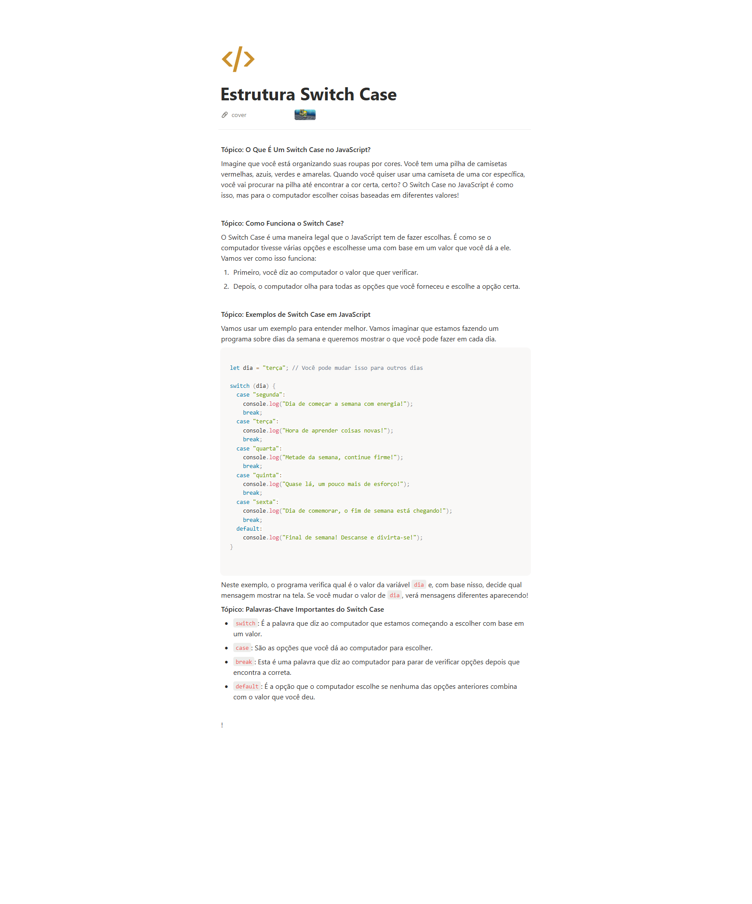

## informacoes

- Material: https://helpful-jump-17b.notion.site/Mapa-de-aventura-91f3e9bd923842149d4dba754dc65c07?p=490c02cf6ccb4368afc3dc131fe04f2a&pm=c

- https://playcode.io/javascript

- https://www.w3schools.com/tryit/trycompiler.asp?filename=demo_nodejs

## Estrutura Switch Case
 = Estrutura de decisao

 **Tópico: O Que É Um Switch Case no JavaScript?**

Imagine que você está organizando suas roupas por cores. Você tem uma pilha de camisetas vermelhas, azuis, verdes e amarelas. Quando você quiser usar uma camiseta de uma cor específica, você vai procurar na pilha até encontrar a cor certa, certo? O Switch Case no JavaScript é como isso, mas para o computador escolher coisas baseadas em diferentes valores!

**Tópico: Como Funciona o Switch Case?**

O Switch Case é uma maneira legal que o JavaScript tem de fazer escolhas. É como se o computador tivesse várias opções e escolhesse uma com base em um valor que você dá a ele. Vamos ver como isso funciona:

1. Primeiro, você diz ao computador o valor que quer verificar.
2. Depois, o computador olha para todas as opções que você forneceu e escolhe a opção certa.

**Tópico: Exemplos de Switch Case em JavaScript**

Vamos usar um exemplo para entender melhor. Vamos imaginar que estamos fazendo um programa sobre dias da semana e queremos mostrar o que você pode fazer em cada dia


```js

let dia = "terça"; // Você pode mudar isso para outros dias

switch (dia) {
  case "segunda":
    console.log("Dia de começar a semana com energia!");
    break;
  case "terça":
    console.log("Hora de aprender coisas novas!");
    break;
  case "quarta":
    console.log("Metade da semana, continue firme!");
    break;
  case "quinta":
    console.log("Quase lá, um pouco mais de esforço!");
    break;
  case "sexta":
    console.log("Dia de comemorar, o fim de semana está chegando!");
    break;
  default:
    cons
    console.log("Final de semana! Descanse e divirta-se!");
}
```


Neste exemplo, o programa verifica qual é o valor da variável `dia` e, com base nisso, decide qual mensagem mostrar na tela. Se você mudar o valor de `dia`, verá mensagens diferentes aparecendo!

**Tópico: Palavras-Chave Importantes do Switch Case**

- `switch`: É a palavra que diz ao computador que estamos começando a escolher com base em um valor.
- `case`: São as opções que você dá ao computador para escolher.
- `break`: Esta é uma palavra que diz ao computador para parar de verificar opções depois que encontra a correta.
- `default`: É a opção que o computador escolhe se nenhuma das opções anteriores combina com o valor que você deu.

swtch : é utilizando quando voce tem muitas situações em que voce precisa testar uma variavel,
e para cada caso executar um bloco de açõe diferentes que também daria para resover com if else if e else.


## Questions

Qual é a principal função da estrutura "switch case" em programação? R:
Avaliar uma expressão e executar diferentes blocos de código com base no valor dessa expressão

O que é o bloco "default" em uma estrutura "switch case"? R:
Um bloco de código a ser executado caso nenhum dos valores das opções seja correspondente

Qual é a finalidade da declaração "break" em uma estrutura "switch case"? R:
Parar a execução da estrutura após um bloco de código ser executado

Como você escreve uma estrutura "switch case" em programação? R:
switch (expressao) { }

A estrutura "switch case" é geralmente usada quando: R:
Existem várias opções a serem avaliadas com base em um valor específico




