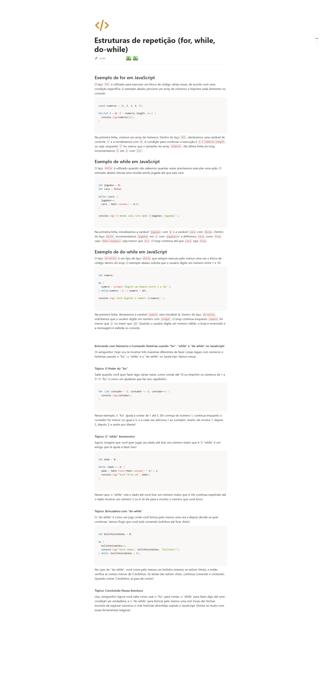

## informacoes

- Material: https://helpful-jump-17b.notion.site/Mapa-de-aventura-91f3e9bd923842149d4dba754dc65c07?p=98796f56714649808b69cf8d45c88a4b&pm=c

- https://playcode.io/javascript

- https://www.w3schools.com/tryit/trycompiler.asp?filename=demo_nodejs

## Estruturas de repetição (for, while, do-while)

## Exemplo de for em JavaScript

O laço `for` é utilizado para executar um bloco de código várias vezes, de acordo com uma condição específica. O exemplo abaixo percorre um array de números e imprime cada elemento no console:

const numeros = [1, 2, 3, 4, 5];

for(let i = 0; i < numeros.length; i++) {
  console.log(numeros[i]);
}

Ex:

let pontosdeVida = 0

for (let possaoMagica = 0; possaoMagica < 10 ; possaoMagica++){
pontosdeVida += 1
console.log(possaoMagica)
}
console.log("pontosdeVida "+ pontosdeVida)

Na primeira linha, criamos um array de números. Dentro do laço for, declaramos uma variável de controle i e a inicializamos com 0. A condição para continuar a execução é i < numeros.length, ou seja, enquanto i for menor que o tamanho do array numeros. Na última linha do loop, incrementamos i em 1 com i++.

## Exemplo de while em JavaScript

O laço `while` é utilizado quando não sabemos quantas vezes precisamos executar uma ação. O exemplo abaixo simula uma moeda sendo jogada até que saia cara:

```jsx
let jogadas = 0;
let cara = false;

while(!cara) {
  jogadas++;
  cara = Math.random() < 0.5;
}
console.log(`A moeda caiu cara após ${jogadas} jogadas!`);


Ex: let contador = 0

while (contador < 3){
console.log("ola")
contador++
}

```
Na primeira linha, inicializamos a variável `jogadas` com `0` e a variável `cara` com `false`. Dentro do laço `while`, incrementamos `jogadas` em `1` com `jogadas++` e definimos `cara` como `true` caso `Math.random()` seja menor que `0.5`. O loop continua até que `cara` seja `true`.

## Exemplo de do-while em JavaScript

O laço `do-while` é um tipo de laço `while` que sempre executa pelo menos uma vez o bloco de código dentro do loop. O exemplo abaixo solicita que o usuário digite um número entre 1 e 10:

```jsx
let numero;

do {
  numero = prompt('Digite um número entre 1 e 10:');
} while(numero < 1 || numero > 10);

console.log(`Você digitou o número ${numero}.`);


Ex:
let contador = 0

do {
   console.log("ola")
   contador++
}
while (contador < 3)

OBS: DO while = Primeiro ele faz, depois ele verifica
        while = verifica primeiro e depois ele faz

```

Na primeira linha, declaramos a variável `numero` sem inicializá-la. Dentro do laço `do-while`, solicitamos que o usuário digite um número com `prompt`. O loop continua enquanto `numero` for menor que `1` ou maior que `10`. Quando o usuário digita um número válido, o loop é encerrado e a mensagem é exibida no console.

**Brincando com Números e Contando Histórias usando "for", "while" e "do-while" no JavaScript!**

Oi amiguinho! Hoje vou te mostrar três maneiras diferentes de fazer coisas legais com números e histórias usando o "for", o "while" e o "do-while" no JavaScript. Vamos nessa!

**Tópico: O Poder do "for"**

Sabe quando você quer fazer algo várias vezes, como contar até 10 ou imprimir os números de 1 a 5? O "for" é como um ajudante que faz isso rapidinho!

```jsx
for (let contador = 1; contador <= 5; contador++) {
  console.log(contador);
}

```

Nesse exemplo, o "for" ajuda a contar de 1 até 5. Ele começa do número 1, continua enquanto o contador for menor ou igual a 5, e a cada vez adiciona 1 ao contador. Assim, ele mostra 1, depois 2, depois 3, e assim por diante!

**Tópico: O "while" Aventureiro**

Agora, imagine que você quer jogar seu dado até tirar um número maior que 4. O "while" é um amigo que te ajuda a fazer isso!

```jsx
let dado = 0;

while (dado <= 4) {
  dado = Math.floor(Math.random() * 6) + 1;
  console.log("Você tirou um", dado);
}

```

Nesse caso, o "while" rola o dado até você tirar um número maior que 4. Ele continua repetindo até o dado mostrar um número 5 ou 6. Aí ele para e mostra o número que você tirou!

**Tópico: Brincadeira com "do-while"**

O "do-while" é como um jogo onde você brinca pelo menos uma vez e depois decide se quer continuar. Vamos fingir que você está comendo bolinhos até ficar cheio!

```jsx
let bolinhosComidos = 0;

do {
  bolinhosComidos++;
  console.log("Você comeu", bolinhosComidos, "bolinhos!");
} while (bolinhosComidos < 5);

```

No caso do "do-while", você come pelo menos um bolinho (mesmo se estiver cheio), e então verifica se comeu menos de 5 bolinhos. Se ainda não estiver cheio, continua comendo e contando. Quando comer 5 bolinhos, aí para de comer!

**Tópico: Concluindo Nossa Aventura**

Uau, amiguinho! Agora você sabe como usar o "for" para contar, o "while" para fazer algo até uma condição ser verdadeira, e o "do-while" para brincar pelo menos uma vez! Essas são formas incríveis de explorar números e criar histórias divertidas usando o JavaScript. Divirta-se muito com essas ferramentas mágicas!


## Questions

Qual é a finalidade da estrutura de repetição "do-while" em programação? R:
Executar um bloco de código pelo menos uma vez e depois repetir com base em uma condição

Qual é a principal diferença entre as estruturas "while" e "do-while"? R:
A estrutura "do-while" executa pelo menos uma vez, mesmo que a condição seja falsa no início

Qual é o propósito principal das estruturas de repetição em programação? R:
Executar um bloco de código várias vezes com base em uma condição

Qual é a principal diferença entre a estrutura "for" e a estrutura "while"? R: 
A estrutura "for" tem a inicialização e incremento da variável de controle na própria declaração, enquanto a estrutura "while" exige essas declarações fora dela.




