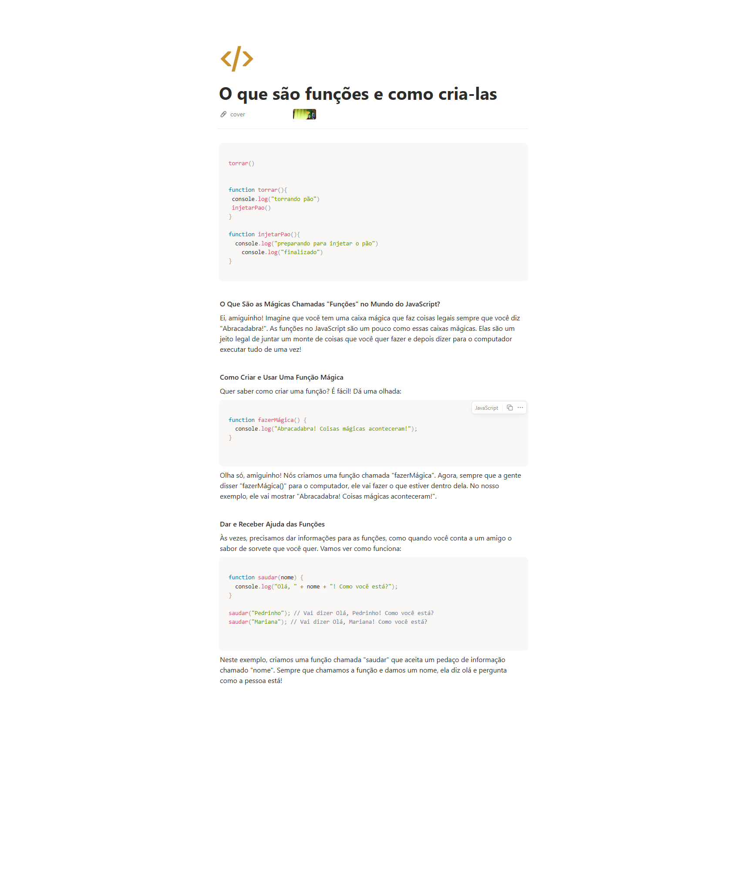

# Material
https://helpful-jump-17b.notion.site/Mapa-de-aventura-91f3e9bd923842149d4dba754dc65c07?p=6b3c1a2a3e154fb08893b8644a0c679a&pm=c

https://www.w3schools.com/tryit/trycompiler.asp?filename=demo_nodejs

# # O que são funções e como cria-las

```jsx
torrar()

function torrar(){
 console.log("torrando pão")
 injetarPao()
}

function injetarPao(){
	console.log("preparando para injetar o pão")
    console.log("finalizado")
}
```

**O Que São as Mágicas Chamadas "Funções" no Mundo do JavaScript?**

Ei, amiguinho! Imagine que você tem uma caixa mágica que faz coisas legais sempre que você diz "Abracadabra!". As funções no JavaScript são um pouco como essas caixas mágicas. Elas são um jeito legal de juntar um monte de coisas que você quer fazer e depois dizer para o computador executar tudo de uma vez!

**Como Criar e Usar Uma Função Mágica**

Quer saber como criar uma função? É fácil! Dá uma olhada:

```jsx
function fazerMágica() {
  console.log("Abracadabra! Coisas mágicas aconteceram!");
}

```

Olha só, amiguinho! Nós criamos uma função chamada "fazerMágica". Agora, sempre que a gente disser "fazerMágica()" para o computador, ele vai fazer o que estiver dentro dela. No nosso exemplo, ele vai mostrar "Abracadabra! Coisas mágicas aconteceram!".

**Dar e Receber Ajuda das Funções**

Às vezes, precisamos dar informações para as funções, como quando você conta a um amigo o sabor de sorvete que você quer. Vamos ver como funciona:

```jsx
function saudar(nome) {
  console.log("Olá, " + nome + "! Como você está?");
}

saudar("Pedrinho"); // Vai dizer Olá, Pedrinho! Como você está?
saudar("Mariana"); // Vai dizer Olá, Mariana! Como você está?

```

Neste exemplo, criamos uma função chamada "saudar" que aceita um pedaço de informação chamado "nome". Sempre que chamamos a função e damos um nome, ela diz olá e pergunta como a pessoa está!


## Exemplos criando funcao e funcao dentro de funcao
Boa pratica: cada funcao deve fazer uma coisa, melhor para manutencao.


torrar()
injetarFuncao()

function torrar(){
console.log("torrando pao")
}

function injetarFuncao(){
console.log("torrando pao")
console.log("mostrar outra funcao ")}


# Uma funcao para chamar varias funcoes

mainSaveData()


function mainSaveData(){
	getData()
	checkValues()
	sendToDataBase()
}

function getData(){
	console.log("pegando os dados")
}

function checkValues(){
	console.log("checando os dados")
}

function sendToDataBase(){
	console.log("Enviando os dados para o banco")
}

# Identacao
é preciso sempre dar um tab conforme as chaves abertas(TAB)

# Questions

Qual é o principal objetivo de usar funções em programação? R:
Promover a reutilização de código e modularizar a lógica em partes gerenciáveis

Qual é a diferença entre uma chamada de função e uma declaração de função? R:
Uma declaração de função cria uma função, enquanto uma chamada de função executa o código dentro dela

O que é uma função em programação? R:
Um bloco de código reutilizável que executa uma tarefa específica quando chamado

Qual afirmação é verdadeira ? R:
Funções criam um pequeno mecanismo inteligente para processar algo no meio da aplicação


