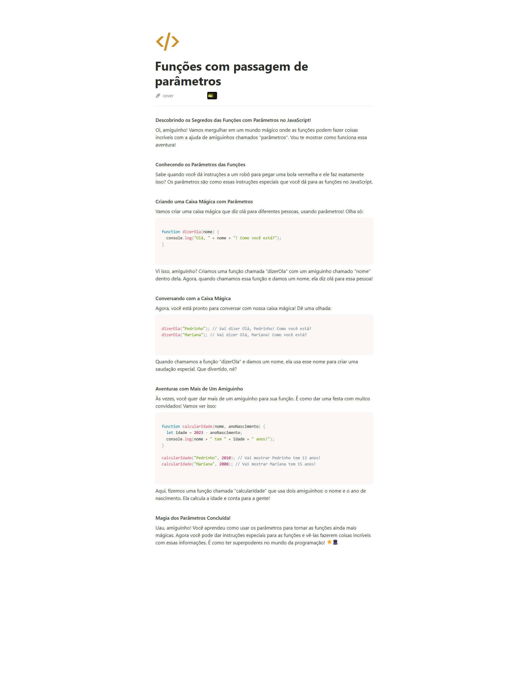

# Material
https://helpful-jump-17b.notion.site/Mapa-de-aventura-91f3e9bd923842149d4dba754dc65c07?p=6d66bf3dd4074a8eae993687f8df020e&pm=c

https://www.w3schools.com/tryit/trycompiler.asp?filename=demo_nodejs

# Funções com passagem de parâmetros

**Descobrindo os Segredos das Funções com Parâmetros no JavaScript!**

Oi, amiguinho! Vamos mergulhar em um mundo mágico onde as funções podem fazer coisas incríveis com a ajuda de amiguinhos chamados "parâmetros". Vou te mostrar como funciona essa aventura!

**Conhecendo os Parâmetros das Funções**

Sabe quando você dá instruções a um robô para pegar uma bola vermelha e ele faz exatamente isso? Os parâmetros são como essas instruções especiais que você dá para as funções no JavaScript.

**Criando uma Caixa Mágica com Parâmetros**

Vamos criar uma caixa mágica que diz olá para diferentes pessoas, usando parâmetros! Olha só:

```jsx
function dizerOla(nome) {
  console.log("Olá, " + nome + "! Como você está?");
}

```

Vi isso, amiguinho? Criamos uma função chamada "dizerOla" com um amiguinho chamado "nome" dentro dela. Agora, quando chamamos essa função e damos um nome, ela diz olá para essa pessoa!

**Conversando com a Caixa Mágica**

Agora, você está pronto para conversar com nossa caixa mágica! Dê uma olhada:

```jsx
dizerOla("Pedrinho"); // Vai dizer Olá, Pedrinho! Como você está?
dizerOla("Mariana"); // Vai dizer Olá, Mariana! Como você está?

```

Quando chamamos a função "dizerOla" e damos um nome, ela usa esse nome para criar uma saudação especial. Que divertido, né?

**Aventuras com Mais de Um Amiguinho**

Às vezes, você quer dar mais de um amiguinho para sua função. É como dar uma festa com muitos convidados! Vamos ver isso:

```jsx
function calcularIdade(nome, anoNascimento) {
  let idade = 2023 - anoNascimento;
  console.log(nome + " tem " + idade + " anos!");
}

calcularIdade("Pedrinho", 2010); // Vai mostrar Pedrinho tem 13 anos!
calcularIdade("Mariana", 2008); // Vai mostrar Mariana tem 15 anos!

```
Ex: 
```jsx

torrar("pao de forma")
torrar("pao integral")

function torrar(pao){
	console.log("torrada feita " + pao)

}


torrar("pao de forma", "felipe")
torrar("pao integral", "janaina")

function torrar(pao, nome){
	console.log("torrada feita " + pao)
    console.log("um pedido de : " + nome)

}
```

# Variavel local sem valor com nome generico

```jsx

torrar("pao de forma")


function torrar(pao, nome = "Cliente"){
	console.log("torrada feita " + pao)
    console.log("um pedido de : " + nome)

}

# Variavel local com valor e com nome generico, se tiver valor o valor declarado é atribuido


torrar("pao de forma", "Anitta")


function torrar(pao, nome = "Cliente"){
	console.log("torrada feita " + pao)
    console.log("um pedido de : " + nome)

}

# Variavel local com valor e com nome generico e numero


torrar("pao de forma", "Anitta", 10.90)


function torrar(pao, nome = "Cliente", valor){
	console.log("torrada feita de " + pao)
    console.log("um pedido de : " + nome)
    console.log("Com o total de : " + valor)

}


```

Funcão com parametros é quando eu quero ter um resultado parecido mas com valores que podem variar.
Ex: Pão ... pao de forma, pao integral

# escopo de variavéis
funcoes ou variaveis declaras local (estão dentro de chaves)
var variavél global 

Insight: Sempre que ver um código ou script, pesquise como será este código em outras linguagens.


# Questions

O que são parâmetros de uma função? R:
Valores que podem ser passados para a função quando ela é chamada e que permitem que a função realize operações com esses valores

Como declarar uma função em javascript ? R:
function nomeDaFuncao() { }

Quantos parâmetros uma função pode receber? R:
Geralmente não há um limite fixo

Qual é a principal vantagem de usar funções que recebem parâmetros? R:
Reutilização da mesma lógica da função com diferentes valores de entrada

Como você define parâmetros em uma declaração de função em linguagens como JavaScript? R:
Dentro dos parênteses da declaração da função, separados por vírgulas


