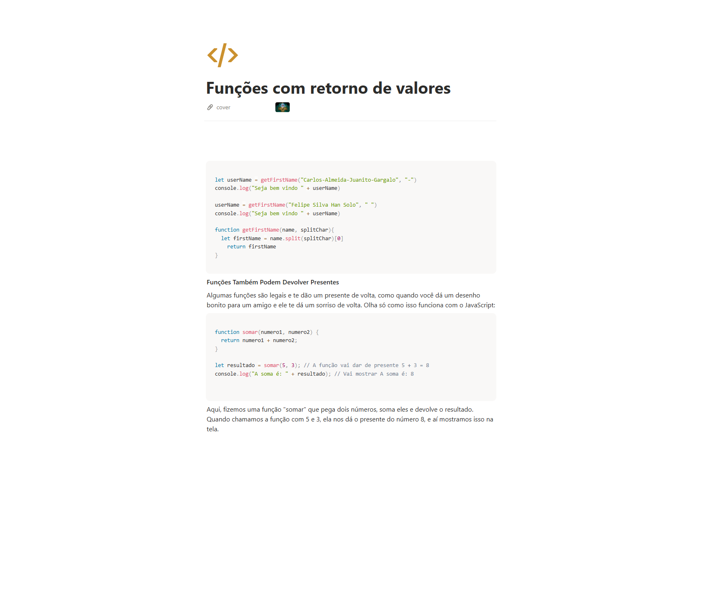

# Material
https://helpful-jump-17b.notion.site/Mapa-de-aventura-91f3e9bd923842149d4dba754dc65c07?p=6ce06a8b5cc04835b63d2ac55804f0da&pm=c

https://www.w3schools.com/tryit/trycompiler.asp?filename=demo_nodejs

# Funções com retorno de valores

```jsx
let userName = getFirstName("Carlos-Almeida-Juanito-Gargalo", "-")
console.log("Seja bem vindo " + userName)

userName = getFirstName("Felipe Silva Han Solo", " ")
console.log("Seja bem vindo " + userName)

function getFirstName(name, splitChar){
	let firstName = name.split(splitChar)[0]
    return firstName
}
```


**Funções Também Podem Devolver Presentes**

Algumas funções são legais e te dão um presente de volta, como quando você dá um desenho bonito para um amigo e ele te dá um sorriso de volta. Olha só como isso funciona com o JavaScript:

```jsx
function somar(numero1, numero2) {
  return numero1 + numero2;
}

let resultado = somar(5, 3); // A função vai dar de presente 5 + 3 = 8
console.log("A soma é: " + resultado); // Vai mostrar A soma é: 8

```

Aqui, fizemos uma função "somar" que pega dois números, soma eles e devolve o resultado. Quando chamamos a função com 5 e 3, ela nos dá o presente do número 8, e aí mostramos isso na tela.

Ex:

```jsx

let resultado = soma(5, 5) // criou uma variavel e ela ira receber o resultao de operacao de uma funcao

console.log("o resultado dessa funcao é " + resultado)

function soma (numA, numB){ // criou a funcao soma para somar os numeros
	let somatorio = numA + numB // criou uma variavel para guardar o resultado da soma
    console.log(somatorio)     // mostra o resultado
    return somatorio           // retorna o resultado
}

```

/////////////////////////////////////////////////////////////////////////////////

## Quebrando nomes com split

```jsx

let userName = getfirstName("Teste Testando Constatando o Teste")

console.log("Seja bem vindo " + userName)

function getfirstName(name){
	let firstName = name.split(" ")[1]
    return firstName

}

//boas praticas: programar em ingles, identacao
//.split quebra por vetor no caso acima é uma espaço ( )

/////////////////////////////////////////////////////////////////////////////////

let userName = getfirstName("Teste-Testando-Constatando-teste-split", "-")
console.log("Seja bem vindo " + userName)

userName = getfirstName("Teste Testando Teste split corte", " ")
console.log("Seja bem vindo " + userName)


function getfirstName(name, splitChar){
	let firstName = name.split(splitChar)[3]
    return firstName

}

// splitChar quebrar conforme o que voce passa nos casos acima ele quebrou em "-" e " " na posição 3 da variavel

```


# Questions

Qual é o principal objetivo de usar funções com retorno em JavaScript? R:
Obter um resultado específico ou um valor calculado a partir da função

Como você especifica o valor de retorno de uma função em JavaScript? R:
Usando a palavra-chave "return" seguida pelo valor que deseja retornar

O que é o valor de retorno de uma função ? R:
Um valor que a função produz como saída após ser executada

O que acontece se você não especificar um valor de retorno em uma função em JavaScript? R:
Undefined


