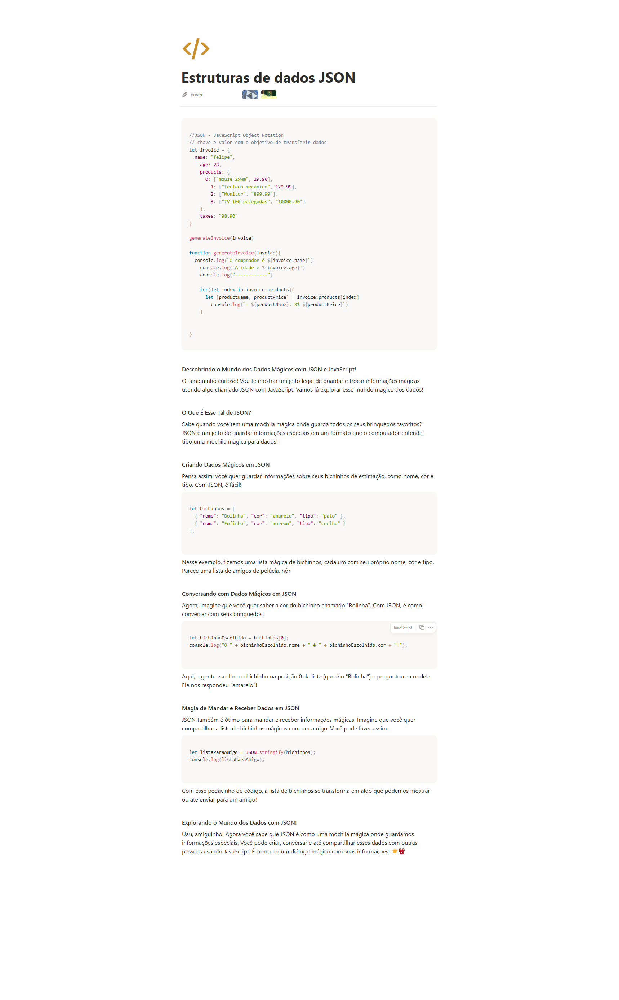

# Material
https://helpful-jump-17b.notion.site/Mapa-de-aventura-91f3e9bd923842149d4dba754dc65c07?p=8bfc6eeb6b2f4e888d7457402351f953&pm=c

https://www.w3schools.com/tryit/trycompiler.asp?filename=demo_nodejs


# JSON
json - javaScript object notation - Notacao de objetos em java script
// Um objeto simples composto por chave e valor com o objetivo de transferir dados


# # Estruturas de dados JSON

## transformando para Json

let name = "Felipe"
let age  = 28
let produtos = ["mouse 2xwm", "Teclado Mecanico", "Monitor"]
let produtosValues = [30.90, 129,80, 250,55]

genereInvoice(name, produtos, produtosValues, age)

function genereInvoice(name, produtos, produtosValues, age){
	console.log("o comprador é " + name)
    console.log("A idade é " + age)    
    console.log("o produto  " + produtos[0])
    console.log("o valor é " + produtosValues[0])
}

// Concatenar= passar os parametros


```jsx

//JSON - JavaScript Object Notation
// chave e valor com o objetivo de transferir dados
let invoice = {
	name: "felipe",
    age: 28,
    products: {
    	0: ["mouse 2xwm", 29.90],
        1: ["Teclado mecânico", 129.99],
        2: ["Monitor", "899.99"],
        3: ["TV 100 polegadas", "10000.90"]
    },
    taxes: "98.90"
}

generateInvoice(invoice)

function generateInvoice(invoice){
	console.log(`O comprador é ${invoice.name}`)
    console.log(`A idade é ${invoice.age}`)
    console.log("------------")
    
    for(let index in invoice.products){
    	let [productName, productPrice] = invoice.products[index]
        console.log(`- ${productName}: R$ ${productPrice}`)
    }
    
    
}
```

**Descobrindo o Mundo dos Dados Mágicos com JSON e JavaScript!**

Oi amiguinho curioso! Vou te mostrar um jeito legal de guardar e trocar informações mágicas usando algo chamado JSON com JavaScript. Vamos lá explorar esse mundo mágico dos dados!

**O Que É Esse Tal de JSON?**

Sabe quando você tem uma mochila mágica onde guarda todos os seus brinquedos favoritos? JSON é um jeito de guardar informações especiais em um formato que o computador entende, tipo uma mochila mágica para dados!

**Criando Dados Mágicos em JSON**

Pensa assim: você quer guardar informações sobre seus bichinhos de estimação, como nome, cor e tipo. Com JSON, é fácil!

```jsx
let bichinhos = [
  { "nome": "Bolinha", "cor": "amarelo", "tipo": "pato" },
  { "nome": "Fofinho", "cor": "marrom", "tipo": "coelho" }
];

```

Nesse exemplo, fizemos uma lista mágica de bichinhos, cada um com seu próprio nome, cor e tipo. Parece uma lista de amigos de pelúcia, né?

**Conversando com Dados Mágicos em JSON**

Agora, imagine que você quer saber a cor do bichinho chamado "Bolinha". Com JSON, é como conversar com seus brinquedos!

```jsx
let bichinhoEscolhido = bichinhos[0];
console.log("O " + bichinhoEscolhido.nome + " é " + bichinhoEscolhido.cor + "!");

```

Aqui, a gente escolheu o bichinho na posição 0 da lista (que é o "Bolinha") e perguntou a cor dele. Ele nos respondeu "amarelo"!

**Magia de Mandar e Receber Dados em JSON**

JSON também é ótimo para mandar e receber informações mágicas. Imagine que você quer compartilhar a lista de bichinhos mágicos com um amigo. Você pode fazer assim:

```jsx
let listaParaAmigo = JSON.stringify(bichinhos);
console.log(listaParaAmigo);

```

Com esse pedacinho de código, a lista de bichinhos se transforma em algo que podemos mostrar ou até enviar para um amigo!

**Explorando o Mundo dos Dados com JSON!**

Uau, amiguinho! Agora você sabe que JSON é como uma mochila mágica onde guardamos informações especiais. Você pode criar, conversar e até compartilhar esses dados com outras pessoas usando JavaScript. É como ter um diálogo mágico com suas informações! 🌟🎒


# Questions

Qual é a principal finalidade do JSON em programação? R: 
Armazenar e trocar dados estruturados entre diferentes sistemas

O que significa a sigla JSON em programação? R:
JavaScript Object Notation

Qual é a estrutura básica dos dados em um objeto JSON? R:
Pares de chave-valor delimitados por ":" e separados por ","

Qual é o formato de um valor numérico dentro de um objeto JSON? R:
Não precisa de aspas, apenas o número


